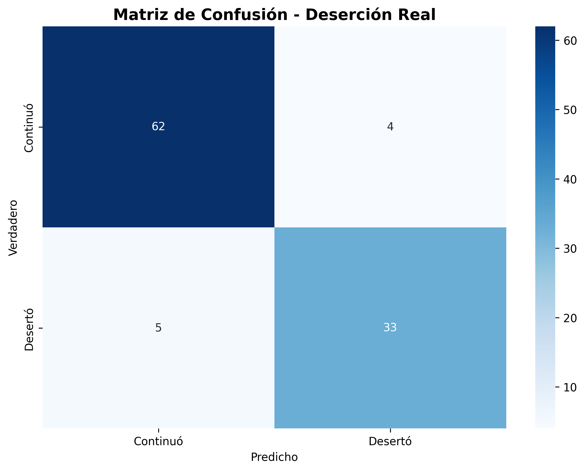
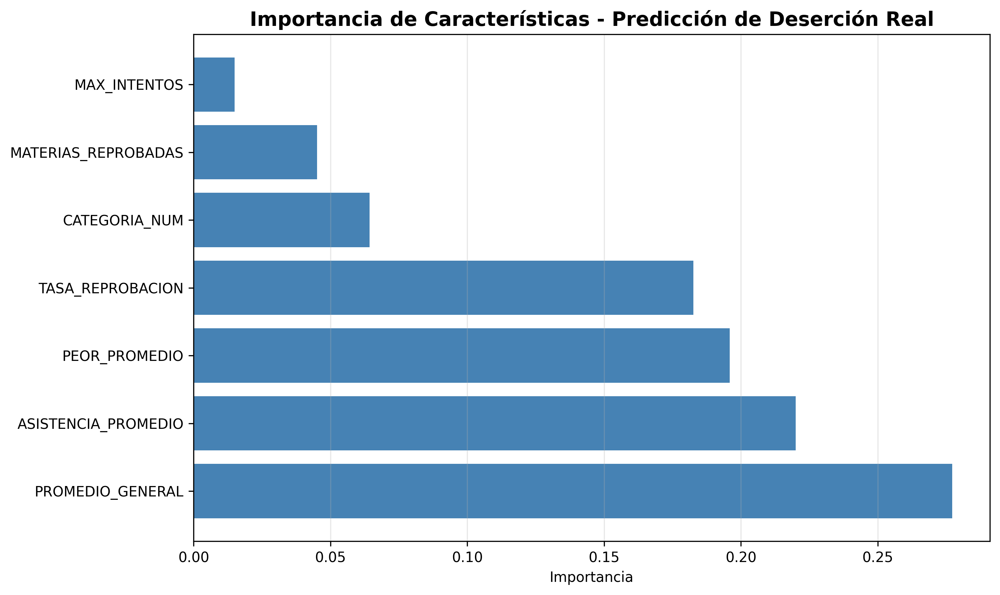

# Proyecto: Predicción de deserción estudiantil

Este proyecto implementa un **modelo sencillo de machine learning** para predecir el **riesgo de deserción estudiantil** y una **interfaz interactiva con Streamlit** para explorar los datos y hacer predicciones individuales.

##  Enlaces
- **App en Vivo:** https://prediccion-desercion-estudiantil.streamlit.app/
- **Documentación:** [Informe Técnico PDF](docs/Informe_Tecnico_CRISP-DM.pdf)

##  Visualizaciones del Proyecto

### Interfaz del Sistema (Streamlit)


### Evaluación del Modelo (Matriz de Confusión)


### Factores Clave de Deserción



---
La estructura básica del proyecto es:

- `📁 data/`: Directorio para el archivo Excel con el récord académico estudiantil.
    - `archivo excel`: REPORTE_RECORD_ESTUDIANTIL_ANONIMIZADO.xlsx
- `📁 models/`: Carpeta generada automáticamente que contiene:
    - `modelo_desercion.pkl`: El modelo entrenado (Random Forest) y metadatos.
    - `analisis_exploratorio.png`: Dashboard visual con las distribuciones institucionales.
    - `matriz_confusion.png`: Evaluación técnica de las predicciones.
    - `importancia_caracteristicas.png`: Gráfico que muestra qué factores pesan más en la deserción.
    - `estudiantes_unicos.csv`: Dataset con el último periodo de cada estudiante, usado para el análisis exploratorio.
    - `estudiantes_procesados.csv`: El dataset final tras la ingeniería de variables (todos los periodos).
- `📁 docs/`: Directorio que contiene el Informe_Tecnico_CRISP-DM en pdf .
- `entrenar.py`: Script principal de procesamiento, limpieza y entrenamiento del modelo.
- `app.py`: Aplicación web interactiva para visualización y predicción individual.
- `requirements.txt`: Lista de dependencias del proyecto.
---

# Metodología CRISP-DM

## 1. Comprensión del negocio
  - Problema: alta **deserción estudiantil** en la institución.
  - Objetivo: identificar **estudiantes en riesgo** para tomar acciones tempranas (tutorías, seguimiento, becas, etc.).

---

## 2. Comprensión de los datos
  - Fuente: `REPORTE_RECORD_ESTUDIANTIL_ANONIMIZADO.xlsx` archivo excel (colocado en data/) con el récord académico de los estudiantes.
  - Se procesa el historial académico para crear un perfil por estudiante y periodo (solo periodos ordinarios CI y CII).
  - Se excluyen materias especiales (homologaciones, convalidaciones, prácticas, trabajos de titulación) para centrarse en las materias regulares.
 
 - **Variables creadas por estudiante-periodo:**

    - **Promedio General:** Rendimiento académico acumulado.

    - **Peor Promedio:** Indicador de la dificultad máxima enfrentada en una materia.

    - **Asistencia Promedio:** Nivel de compromiso real (filtrando materias homologadas).

    - **Tasa de Reprobación:** Relación entre materias perdidas y materias totales cursadas.

    - **Máximo de Intentos:** Número máximo de veces que ha cursado una materia.

    - **Categoría de Riesgo:** Se asigna una categoría (BAJO, MEDIO, ALTO, DESERTOR) basada en un sistema de puntos que evalúa condiciones críticas.

  - Detección de deserción real: Un estudiante se considera desertor en un periodo si no aparece en periodos posteriores (excepto en el último periodo general, donde no se puede determinar).

---

## 3. Preparacion de los datos
   -  Limpieza: manejo de valores nulos, conversión de tipos de datos.

   - Ingeniería de características: creación de las variables agregadas mencionadas.

   -  Filtrado: solo se consideran periodos ordinarios (CI y CII).

---
## 4. Modelado
 - Se seleccionó un **Random Forest Classifier**:

    - Configuración: 100 árboles de decisión con class_weight='balanced' para manejar el desequilibrio de clases.

    - Características utilizadas: 7 variables (Promedio General, Peor Promedio, Asistencia Promedio, Máximo de Intentos, Materias Reprobadas, Tasa de Reprobación, Categoría de Riesgo numérica).

- El modelo se entrena para predecir la deserción real (binaria: 0 = continuó, 1 = desertó) utilizando datos históricos.

---

## 5. Evaluación
El modelo se valida con un conjunto de prueba (20%) utilizando:
* **Métricas:** Accuracy, Precisión, Recall y F1-Score.
* **Matriz de Confusión:** Para observar la fiabilidad en la detección de casos de Alto Riesgo.

## 6. Despliegue
  - Despliegue simple a nivel académico: ejecución local o en la nube de la app con Streamlit:

    - Análisis Exploratorio: Visualización de la distribución de categorías de riesgo y estadísticas descriptivas.


    - Métricas del Modelo: Revisión del rendimiento del modelo y importancia de las características.

    - Predicción de Deserción (ML): Formulario interactivo para predecir, usando el modelo entrenado, si un estudiante desertará basándose en sus características académicas.
    
    - Ver Todos Estudiantes: Tabla interactiva con filtros y ordenamiento, que muestra el último periodo de cada estudiante y permite exportar los datos.
    
    - Gestión y Exportación de Datos: * Filtrado avanzado por nivel de riesgo (ej. ver solo estudiantes en "DESERTOR").

    - Descarga de reportes en formatos CSV y Excel, permitiendo que las listas de estudiantes en riesgo sean entregadas directamente a los tutores para intervención inmediata.

---

# Cómo preparar y ejecutar el proyecto

## 1. Clona el repositorio:
```bash
git clone https://github.com/Robe1o/prediccion-desercion-estudiantil.git
cd prediccion-desercion-estudiantil
```

**2. Instalar dependencias**
--
```bash
pip install -r requirements.txt
```

---

**3. Entrenar el modelo**
--
Desde la carpeta del proyecto:

```bash
python entrenar.py
```

---

**4. Ejecutar la aplicación Streamlit** (local)
--
Desde la misma carpeta:

```bash
python -m streamlit run app.py
```
#####  -  La aplicación se abrirá en tu navegador predeterminado.

***
## 5. Uso en la nube
La aplicación también está desplegada en Streamlit Cloud y disponible en:  
https://prediccion-desercion-estudiantil.streamlit.app/

---
###  Proyecto Final de Almacenes y Minería de Datos
**Realizado por:** Roberto Alvarez  
**Nivel:** 5to Semestre - Ciencia de Datos e IA  
**Fecha:** Febrero 2026   
**Institución:** Universidad de Guayaquil (UG)


#### Nota: Este proyecto es con fines académicos y puede adaptarse a diferentes contextos institucionales.